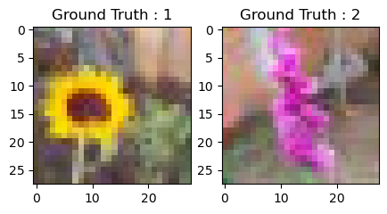
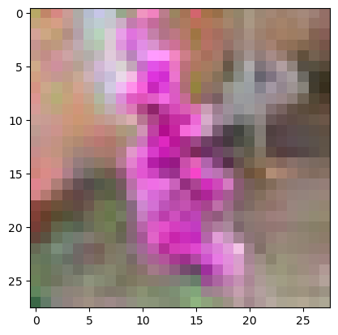
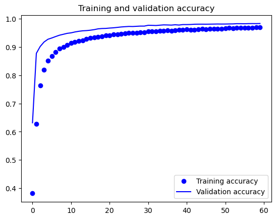
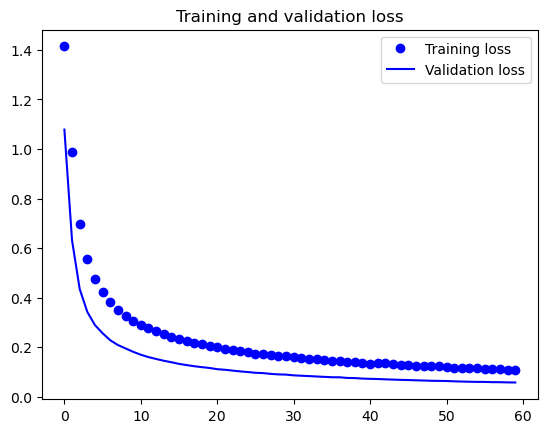
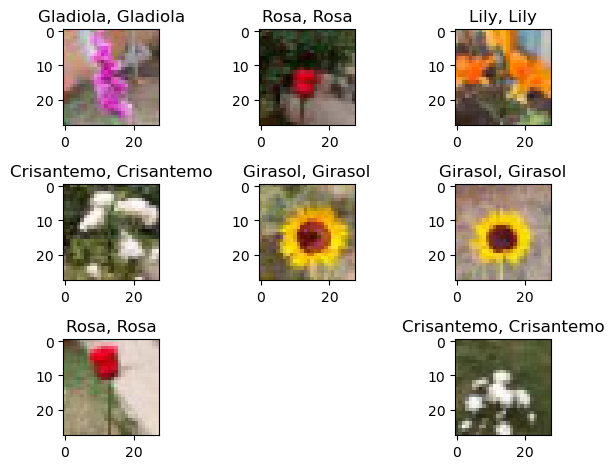
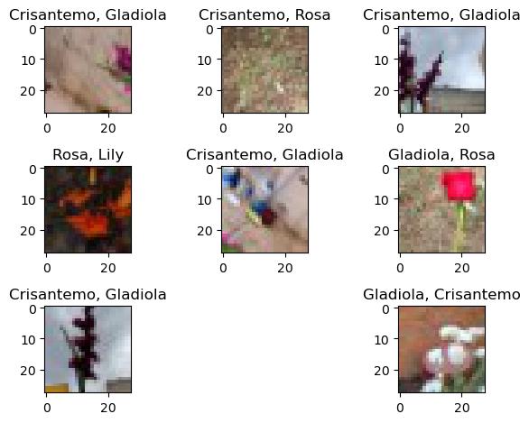
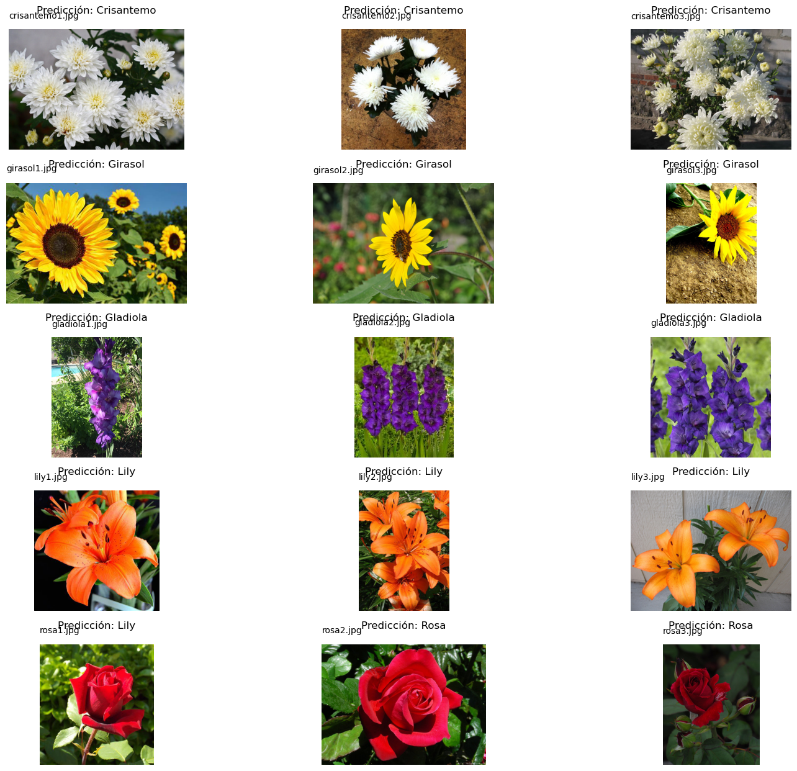

```python
import cv2 
```

# Convolutional Neural Networks


# Importar Librerías


```python
import numpy as np
import os
import re
import matplotlib.pyplot as plt
%matplotlib inline
from sklearn.model_selection import train_test_split
from sklearn.metrics import classification_report
```


```python
import keras
import tensorflow as tf
from tensorflow.keras.utils import to_categorical
from keras.models import Sequential,Model
from tensorflow.keras.layers import Input
from keras.layers import Dense, Dropout, Flatten
#from keras.layers import Conv2D, MaxPooling2D
#from tensorflow.keras.models import Sequential
from tensorflow.keras.layers import (
    BatchNormalization, SeparableConv2D, MaxPooling2D, Activation, Flatten, Dropout, Dense, Conv2D
)
from keras.layers import LeakyReLU
```

    WARNING:tensorflow:From C:\Users\zerog\anaconda3\Lib\site-packages\keras\src\losses.py:2976: The name tf.losses.sparse_softmax_cross_entropy is deprecated. Please use tf.compat.v1.losses.sparse_softmax_cross_entropy instead.
    
    

# Cargar set de Imágenes


```python
dirname = os.path.join(os.getcwd(),'C:/Users/zerog/Documents/Noveno Semestre/IA/Nuevos Datasets/Flores Esperanza Final 28')
imgpath = dirname + os.sep 

images = []
directories = []
dircount = []
prevRoot=''
cant=0

print("leyendo imagenes de ",imgpath)

for root, dirnames, filenames in os.walk(imgpath):
    for filename in filenames:
        if re.search("\.(jpg|jpeg|png|bmp|tiff)$", filename):
            cant=cant+1
            filepath = os.path.join(root, filename)
            image = plt.imread(filepath)
            if(len(image.shape)==3):
                
                images.append(image)
            b = "Leyendo..." + str(cant)
            print (b, end="\r")
            if prevRoot !=root:
                print(root, cant)
                prevRoot=root
                directories.append(root)
                dircount.append(cant)
                cant=0
dircount.append(cant)

dircount = dircount[1:]
dircount[0]=dircount[0]+1
print('Directorios leidos:',len(directories))
print("Imagenes en cada directorio", dircount)
print('suma Total de imagenes en subdirs:',sum(dircount))
```

    leyendo imagenes de  C:/Users/zerog/Documents/Noveno Semestre/IA/Nuevos Datasets/Flores Esperanza Final 28\
    C:/Users/zerog/Documents/Noveno Semestre/IA/Nuevos Datasets/Flores Esperanza Final 28\Crisantemo 1
    C:/Users/zerog/Documents/Noveno Semestre/IA/Nuevos Datasets/Flores Esperanza Final 28\Girasol 10848
    C:/Users/zerog/Documents/Noveno Semestre/IA/Nuevos Datasets/Flores Esperanza Final 28\Gladiola 13906
    C:/Users/zerog/Documents/Noveno Semestre/IA/Nuevos Datasets/Flores Esperanza Final 28\Lily 9918
    C:/Users/zerog/Documents/Noveno Semestre/IA/Nuevos Datasets/Flores Esperanza Final 28\Rosa 15437
    Directorios leidos: 5
    Imagenes en cada directorio [10849, 13906, 9918, 15437, 12707]
    suma Total de imagenes en subdirs: 62817
    

# Creamos las etiquetas


```python
labels=[]
indice=0
for cantidad in dircount:
    for i in range(cantidad):
        labels.append(indice)
    indice=indice+1
print("Cantidad etiquetas creadas: ",len(labels))

```

    Cantidad etiquetas creadas:  62817
    


```python
flores=[]
indice=0
for directorio in directories:
    name = directorio.split(os.sep)
    print(indice , name[len(name)-1])
    flores.append(name[len(name)-1])
    indice=indice+1
```

    0 Crisantemo
    1 Girasol
    2 Gladiola
    3 Lily
    4 Rosa
    


```python
y = np.array(labels)
X = np.array(images, dtype=np.uint8) #convierto de lista a numpy


# Find the unique numbers from the train labels
classes = np.unique(y)
nClasses = len(classes)
print('Total number of outputs : ', nClasses)
print('Output classes : ', classes)
```

    Total number of outputs :  5
    Output classes :  [0 1 2 3 4]
    

# Creamos Sets de Entrenamiento y Test


```python
train_X,test_X,train_Y,test_Y = train_test_split(X,y,test_size=0.2)
print('Training data shape : ', train_X.shape, train_Y.shape)
print('Testing data shape : ', test_X.shape, test_Y.shape)
```

    Training data shape :  (50253, 28, 28, 3) (50253,)
    Testing data shape :  (12564, 28, 28, 3) (12564,)
    


```python
plt.figure(figsize=[5,5])

# Display the first image in training data
plt.subplot(121)
plt.imshow(train_X[0,:,:], cmap='gray')
plt.title("Ground Truth : {}".format(train_Y[0]))

# Display the first image in testing data
plt.subplot(122)
plt.imshow(test_X[0,:,:], cmap='gray')
plt.title("Ground Truth : {}".format(test_Y[0]))
```


    Text(0.5, 1.0, 'Ground Truth : 2')


    

    


# Preprocesamos las imagenes


```python
train_X = train_X.astype('float32')
test_X = test_X.astype('float32')
train_X = train_X/255.
test_X = test_X/255.
plt.imshow(test_X[0,:,:])
```


    <matplotlib.image.AxesImage at 0x259dc0c8510>


    

    


## Hacemos el One-hot Encoding para la red


```python
# Change the labels from categorical to one-hot encoding
train_Y_one_hot = to_categorical(train_Y)
test_Y_one_hot = to_categorical(test_Y)

# Display the change for category label using one-hot encoding
print('Original label:', train_Y[0])
print('After conversion to one-hot:', train_Y_one_hot[0])
```

    Original label: 1
    After conversion to one-hot: [0. 1. 0. 0. 0.]
    

# Creamos el Set de Entrenamiento y Validación


```python
#Mezclar todo y crear los grupos de entrenamiento y testing
train_X,valid_X,train_label,valid_label = train_test_split(train_X, train_Y_one_hot, test_size=0.2, random_state=13)
```


```python
print(train_X.shape,valid_X.shape,train_label.shape,valid_label.shape)
```

    (40202, 28, 28, 3) (10051, 28, 28, 3) (40202, 5) (10051, 5)
    

# Creamos el modelo de CNN


```python
#declaramos variables con los parámetros de configuración de la red
INIT_LR = 1e-3 # Valor inicial de learning rate. El valor 1e-3 corresponde con 0.001
epochs = 60 # Cantidad de iteraciones completas al conjunto de imagenes de entrenamiento
batch_size = 32 # cantidad de imágenes que se toman a la vez en memoria

sport_model = Sequential()
sport_model.add(Conv2D(32, kernel_size=(3, 3),activation='linear',padding='same',input_shape=(28,28,3)))
sport_model.add(LeakyReLU(alpha=0.1))
sport_model.add(MaxPooling2D((2, 2),padding='same'))
sport_model.add(Dropout(0.5))

sport_model.add(Flatten())
sport_model.add(Dense(32, activation='linear'))
sport_model.add(LeakyReLU(alpha=0.1))
sport_model.add(Dropout(0.5))
sport_model.add(Dense(nClasses, activation='softmax'))
```

    WARNING:tensorflow:From C:\Users\zerog\anaconda3\Lib\site-packages\keras\src\backend.py:873: The name tf.get_default_graph is deprecated. Please use tf.compat.v1.get_default_graph instead.
    
    WARNING:tensorflow:From C:\Users\zerog\anaconda3\Lib\site-packages\keras\src\layers\pooling\max_pooling2d.py:161: The name tf.nn.max_pool is deprecated. Please use tf.nn.max_pool2d instead.
    
    


```python
sport_model.summary()
```

    Model: "sequential"
    _________________________________________________________________
     Layer (type)                Output Shape              Param #   
    =================================================================
     conv2d (Conv2D)             (None, 28, 28, 32)        896       
                                                                     
     leaky_re_lu (LeakyReLU)     (None, 28, 28, 32)        0         
                                                                     
     max_pooling2d (MaxPooling2  (None, 14, 14, 32)        0         
     D)                                                              
                                                                     
     dropout (Dropout)           (None, 14, 14, 32)        0         
                                                                     
     flatten (Flatten)           (None, 6272)              0         
                                                                     
     dense (Dense)               (None, 32)                200736    
                                                                     
     leaky_re_lu_1 (LeakyReLU)   (None, 32)                0         
                                                                     
     dropout_1 (Dropout)         (None, 32)                0         
                                                                     
     dense_1 (Dense)             (None, 5)                 165       
                                                                     
    =================================================================
    Total params: 201797 (788.27 KB)
    Trainable params: 201797 (788.27 KB)
    Non-trainable params: 0 (0.00 Byte)
    _________________________________________________________________
    


```python
sport_model.compile(loss=keras.losses.categorical_crossentropy, optimizer=tf.keras.optimizers.legacy.SGD(learning_rate=INIT_LR, decay=INIT_LR / 100),metrics=['accuracy'])
```

# Entrenamos el modelo: Aprende a clasificar imágenes


```python
# este paso puede tomar varios minutos, dependiendo de tu ordenador, cpu y memoria ram libre
sport_train = sport_model.fit(train_X, train_label, batch_size=batch_size,epochs=epochs,verbose=1,validation_data=(valid_X, valid_label))
```

    Epoch 1/60
    WARNING:tensorflow:From C:\Users\zerog\anaconda3\Lib\site-packages\keras\src\utils\tf_utils.py:492: The name tf.ragged.RaggedTensorValue is deprecated. Please use tf.compat.v1.ragged.RaggedTensorValue instead.
    
    WARNING:tensorflow:From C:\Users\zerog\anaconda3\Lib\site-packages\keras\src\engine\base_layer_utils.py:384: The name tf.executing_eagerly_outside_functions is deprecated. Please use tf.compat.v1.executing_eagerly_outside_functions instead.
    
    1257/1257 [==============================] - 9s 7ms/step - loss: 1.4139 - accuracy: 0.3815 - val_loss: 1.0784 - val_accuracy: 0.6316
    Epoch 2/60
    1257/1257 [==============================] - 9s 7ms/step - loss: 0.9883 - accuracy: 0.6273 - val_loss: 0.6311 - val_accuracy: 0.8774
    Epoch 3/60
    1257/1257 [==============================] - 8s 7ms/step - loss: 0.6956 - accuracy: 0.7642 - val_loss: 0.4347 - val_accuracy: 0.9017
    Epoch 4/60
    1257/1257 [==============================] - 9s 7ms/step - loss: 0.5547 - accuracy: 0.8184 - val_loss: 0.3420 - val_accuracy: 0.9175
    Epoch 5/60
    1257/1257 [==============================] - 8s 7ms/step - loss: 0.4735 - accuracy: 0.8505 - val_loss: 0.2888 - val_accuracy: 0.9272
    Epoch 6/60
    1257/1257 [==============================] - 8s 7ms/step - loss: 0.4210 - accuracy: 0.8670 - val_loss: 0.2559 - val_accuracy: 0.9317
    Epoch 7/60
    1257/1257 [==============================] - 9s 7ms/step - loss: 0.3813 - accuracy: 0.8810 - val_loss: 0.2276 - val_accuracy: 0.9368
    Epoch 8/60
    1257/1257 [==============================] - 9s 7ms/step - loss: 0.3490 - accuracy: 0.8936 - val_loss: 0.2084 - val_accuracy: 0.9416
    Epoch 9/60
    1257/1257 [==============================] - 9s 7ms/step - loss: 0.3270 - accuracy: 0.8993 - val_loss: 0.1946 - val_accuracy: 0.9449
    Epoch 10/60
    1257/1257 [==============================] - 9s 7ms/step - loss: 0.3068 - accuracy: 0.9071 - val_loss: 0.1810 - val_accuracy: 0.9482
    Epoch 11/60
    1257/1257 [==============================] - 9s 7ms/step - loss: 0.2880 - accuracy: 0.9137 - val_loss: 0.1691 - val_accuracy: 0.9500
    Epoch 12/60
    1257/1257 [==============================] - 9s 7ms/step - loss: 0.2772 - accuracy: 0.9168 - val_loss: 0.1596 - val_accuracy: 0.9530
    Epoch 13/60
    1257/1257 [==============================] - 9s 7ms/step - loss: 0.2641 - accuracy: 0.9215 - val_loss: 0.1520 - val_accuracy: 0.9554
    Epoch 14/60
    1257/1257 [==============================] - 9s 7ms/step - loss: 0.2542 - accuracy: 0.9228 - val_loss: 0.1449 - val_accuracy: 0.9571
    Epoch 15/60
    1257/1257 [==============================] - 9s 7ms/step - loss: 0.2421 - accuracy: 0.9289 - val_loss: 0.1388 - val_accuracy: 0.9579
    Epoch 16/60
    1257/1257 [==============================] - 10s 8ms/step - loss: 0.2307 - accuracy: 0.9322 - val_loss: 0.1322 - val_accuracy: 0.9593
    Epoch 17/60
    1257/1257 [==============================] - 9s 7ms/step - loss: 0.2244 - accuracy: 0.9344 - val_loss: 0.1273 - val_accuracy: 0.9613
    Epoch 18/60
    1257/1257 [==============================] - 9s 7ms/step - loss: 0.2165 - accuracy: 0.9363 - val_loss: 0.1227 - val_accuracy: 0.9641
    Epoch 19/60
    1257/1257 [==============================] - 10s 8ms/step - loss: 0.2113 - accuracy: 0.9379 - val_loss: 0.1190 - val_accuracy: 0.9653
    Epoch 20/60
    1257/1257 [==============================] - 10s 8ms/step - loss: 0.2035 - accuracy: 0.9413 - val_loss: 0.1156 - val_accuracy: 0.9657
    Epoch 21/60
    1257/1257 [==============================] - 10s 8ms/step - loss: 0.1988 - accuracy: 0.9411 - val_loss: 0.1107 - val_accuracy: 0.9669
    Epoch 22/60
    1257/1257 [==============================] - 10s 8ms/step - loss: 0.1936 - accuracy: 0.9446 - val_loss: 0.1084 - val_accuracy: 0.9678
    Epoch 23/60
    1257/1257 [==============================] - 10s 8ms/step - loss: 0.1893 - accuracy: 0.9448 - val_loss: 0.1051 - val_accuracy: 0.9693
    Epoch 24/60
    1257/1257 [==============================] - 10s 8ms/step - loss: 0.1848 - accuracy: 0.9467 - val_loss: 0.1019 - val_accuracy: 0.9707
    Epoch 25/60
    1257/1257 [==============================] - 10s 8ms/step - loss: 0.1796 - accuracy: 0.9488 - val_loss: 0.0993 - val_accuracy: 0.9717
    Epoch 26/60
    1257/1257 [==============================] - 10s 8ms/step - loss: 0.1736 - accuracy: 0.9492 - val_loss: 0.0963 - val_accuracy: 0.9726
    Epoch 27/60
    1257/1257 [==============================] - 10s 8ms/step - loss: 0.1729 - accuracy: 0.9505 - val_loss: 0.0949 - val_accuracy: 0.9723
    Epoch 28/60
    1257/1257 [==============================] - 10s 8ms/step - loss: 0.1682 - accuracy: 0.9506 - val_loss: 0.0918 - val_accuracy: 0.9731
    Epoch 29/60
    1257/1257 [==============================] - 10s 8ms/step - loss: 0.1647 - accuracy: 0.9525 - val_loss: 0.0897 - val_accuracy: 0.9738
    Epoch 30/60
    1257/1257 [==============================] - 10s 8ms/step - loss: 0.1654 - accuracy: 0.9525 - val_loss: 0.0888 - val_accuracy: 0.9738
    Epoch 31/60
    1257/1257 [==============================] - 10s 8ms/step - loss: 0.1598 - accuracy: 0.9544 - val_loss: 0.0859 - val_accuracy: 0.9767
    Epoch 32/60
    1257/1257 [==============================] - 10s 8ms/step - loss: 0.1561 - accuracy: 0.9551 - val_loss: 0.0843 - val_accuracy: 0.9764
    Epoch 33/60
    1257/1257 [==============================] - 10s 8ms/step - loss: 0.1538 - accuracy: 0.9556 - val_loss: 0.0829 - val_accuracy: 0.9759
    Epoch 34/60
    1257/1257 [==============================] - 9s 7ms/step - loss: 0.1515 - accuracy: 0.9564 - val_loss: 0.0812 - val_accuracy: 0.9770
    Epoch 35/60
    1257/1257 [==============================] - 9s 8ms/step - loss: 0.1481 - accuracy: 0.9567 - val_loss: 0.0798 - val_accuracy: 0.9781
    Epoch 36/60
    1257/1257 [==============================] - 10s 8ms/step - loss: 0.1449 - accuracy: 0.9592 - val_loss: 0.0782 - val_accuracy: 0.9778
    Epoch 37/60
    1257/1257 [==============================] - 10s 8ms/step - loss: 0.1446 - accuracy: 0.9578 - val_loss: 0.0781 - val_accuracy: 0.9773
    Epoch 38/60
    1257/1257 [==============================] - 10s 8ms/step - loss: 0.1414 - accuracy: 0.9593 - val_loss: 0.0755 - val_accuracy: 0.9785
    Epoch 39/60
    1257/1257 [==============================] - 10s 8ms/step - loss: 0.1389 - accuracy: 0.9598 - val_loss: 0.0748 - val_accuracy: 0.9775
    Epoch 40/60
    1257/1257 [==============================] - 10s 8ms/step - loss: 0.1362 - accuracy: 0.9613 - val_loss: 0.0728 - val_accuracy: 0.9792
    Epoch 41/60
    1257/1257 [==============================] - 10s 8ms/step - loss: 0.1336 - accuracy: 0.9617 - val_loss: 0.0718 - val_accuracy: 0.9792
    Epoch 42/60
    1257/1257 [==============================] - 10s 8ms/step - loss: 0.1355 - accuracy: 0.9608 - val_loss: 0.0711 - val_accuracy: 0.9795
    Epoch 43/60
    1257/1257 [==============================] - 10s 8ms/step - loss: 0.1338 - accuracy: 0.9614 - val_loss: 0.0698 - val_accuracy: 0.9804
    Epoch 44/60
    1257/1257 [==============================] - 10s 8ms/step - loss: 0.1308 - accuracy: 0.9626 - val_loss: 0.0687 - val_accuracy: 0.9806
    Epoch 45/60
    1257/1257 [==============================] - 10s 8ms/step - loss: 0.1263 - accuracy: 0.9647 - val_loss: 0.0676 - val_accuracy: 0.9806
    Epoch 46/60
    1257/1257 [==============================] - 10s 8ms/step - loss: 0.1263 - accuracy: 0.9631 - val_loss: 0.0670 - val_accuracy: 0.9805
    Epoch 47/60
    1257/1257 [==============================] - 10s 8ms/step - loss: 0.1242 - accuracy: 0.9646 - val_loss: 0.0658 - val_accuracy: 0.9807
    Epoch 48/60
    1257/1257 [==============================] - 10s 8ms/step - loss: 0.1248 - accuracy: 0.9643 - val_loss: 0.0650 - val_accuracy: 0.9809
    Epoch 49/60
    1257/1257 [==============================] - 10s 8ms/step - loss: 0.1227 - accuracy: 0.9644 - val_loss: 0.0640 - val_accuracy: 0.9812
    Epoch 50/60
    1257/1257 [==============================] - 10s 8ms/step - loss: 0.1226 - accuracy: 0.9646 - val_loss: 0.0635 - val_accuracy: 0.9810
    Epoch 51/60
    1257/1257 [==============================] - 10s 8ms/step - loss: 0.1189 - accuracy: 0.9652 - val_loss: 0.0630 - val_accuracy: 0.9811
    Epoch 52/60
    1257/1257 [==============================] - 10s 8ms/step - loss: 0.1173 - accuracy: 0.9670 - val_loss: 0.0618 - val_accuracy: 0.9814
    Epoch 53/60
    1257/1257 [==============================] - 10s 8ms/step - loss: 0.1175 - accuracy: 0.9661 - val_loss: 0.0609 - val_accuracy: 0.9816
    Epoch 54/60
    1257/1257 [==============================] - 10s 8ms/step - loss: 0.1165 - accuracy: 0.9670 - val_loss: 0.0600 - val_accuracy: 0.9824
    Epoch 55/60
    1257/1257 [==============================] - 9s 8ms/step - loss: 0.1148 - accuracy: 0.9671 - val_loss: 0.0595 - val_accuracy: 0.9823
    Epoch 56/60
    1257/1257 [==============================] - 10s 8ms/step - loss: 0.1133 - accuracy: 0.9676 - val_loss: 0.0594 - val_accuracy: 0.9821
    Epoch 57/60
    1257/1257 [==============================] - 10s 8ms/step - loss: 0.1135 - accuracy: 0.9670 - val_loss: 0.0584 - val_accuracy: 0.9826
    Epoch 58/60
    1257/1257 [==============================] - 10s 8ms/step - loss: 0.1121 - accuracy: 0.9673 - val_loss: 0.0583 - val_accuracy: 0.9827
    Epoch 59/60
    1257/1257 [==============================] - 9s 7ms/step - loss: 0.1089 - accuracy: 0.9690 - val_loss: 0.0574 - val_accuracy: 0.9826
    Epoch 60/60
    1257/1257 [==============================] - 9s 7ms/step - loss: 0.1072 - accuracy: 0.9701 - val_loss: 0.0571 - val_accuracy: 0.9830
    

# Guardamos el modelo


```python
# guardamos la red, para reutilizarla en el futuro, sin tener que volver a entrenar
Ruta= "C:/Users/zerog/Documents/Noveno Semestre/IA/Datasets/CNN/CNN_Flores2/flores.h5py"
if not os.path.exists(Ruta):
    print('Carpeta creada: ', Ruta)
    os.makedirs(Ruta)
sport_model.save(Ruta)
```

    Carpeta creada:  C:/Users/zerog/Documents/Noveno Semestre/IA/Datasets/CNN/CNN_Flores2/flores.h5py
    INFO:tensorflow:Assets written to: C:/Users/zerog/Documents/Noveno Semestre/IA/Datasets/CNN/CNN_Flores2/flores.h5py\assets
    

    INFO:tensorflow:Assets written to: C:/Users/zerog/Documents/Noveno Semestre/IA/Datasets/CNN/CNN_Flores2/flores.h5py\assets
    

# Evaluamos la red


```python
test_eval = sport_model.evaluate(test_X, test_Y_one_hot, verbose=1)
```

    393/393 [==============================] - 1s 3ms/step - loss: 0.0619 - accuracy: 0.9842
    


```python
print('Test loss:', test_eval[0])
print('Test accuracy:', test_eval[1])
```

    Test loss: 0.0618651881814003
    Test accuracy: 0.9841610789299011
    


```python
sport_train.history
```


    {'loss': [1.4139442443847656,
      0.9882681369781494,
      0.6955661177635193,
      0.5546821355819702,
      0.4735192656517029,
      0.42100536823272705,
      0.3813450038433075,
      0.34897106885910034,
      0.3270058333873749,
      0.30679255723953247,
      0.28799596428871155,
      0.277192622423172,
      0.2641359865665436,
      0.25421568751335144,
      0.24206504225730896,
      0.2307119518518448,
      0.22443583607673645,
      0.2164531946182251,
      0.21128419041633606,
      0.20350849628448486,
      0.19884894788265228,
      0.19364428520202637,
      0.18933579325675964,
      0.18479958176612854,
      0.17955268919467926,
      0.17357297241687775,
      0.17294232547283173,
      0.16823634505271912,
      0.16465866565704346,
      0.165440171957016,
      0.15983904898166656,
      0.1560976207256317,
      0.1538151353597641,
      0.15150119364261627,
      0.14806684851646423,
      0.1449425220489502,
      0.1445608139038086,
      0.141403928399086,
      0.1388760805130005,
      0.1361847072839737,
      0.13363611698150635,
      0.1355305165052414,
      0.13375267386436462,
      0.13077926635742188,
      0.1262681484222412,
      0.126250222325325,
      0.12419302761554718,
      0.12477891147136688,
      0.12269032746553421,
      0.12255997955799103,
      0.11891020834445953,
      0.11732570827007294,
      0.11749628931283951,
      0.11654585599899292,
      0.11480741947889328,
      0.11334317177534103,
      0.11346057802438736,
      0.11212434619665146,
      0.1089145690202713,
      0.10719253867864609],
     'accuracy': [0.381473571062088,
      0.627307116985321,
      0.7641659379005432,
      0.8183920979499817,
      0.8504800796508789,
      0.8669717907905579,
      0.8810009360313416,
      0.8935624957084656,
      0.8993333578109741,
      0.9071190357208252,
      0.913661003112793,
      0.9168200492858887,
      0.9214964509010315,
      0.9228396415710449,
      0.9288841485977173,
      0.9321924448013306,
      0.9344062209129333,
      0.9362967014312744,
      0.937938392162323,
      0.9412964582443237,
      0.9410974383354187,
      0.9445798993110657,
      0.9448286294937134,
      0.9467190504074097,
      0.9487836360931396,
      0.9491567611694336,
      0.9504750967025757,
      0.9506492018699646,
      0.9524899125099182,
      0.9524899125099182,
      0.9543554782867432,
      0.9551265835762024,
      0.9555992484092712,
      0.9564449787139893,
      0.9566687941551208,
      0.9592059850692749,
      0.9578379392623901,
      0.9593303799629211,
      0.9598029851913452,
      0.961295485496521,
      0.9616685509681702,
      0.9607979655265808,
      0.9613949656486511,
      0.9626138210296631,
      0.9647281169891357,
      0.9631112813949585,
      0.9645788669586182,
      0.9642555117607117,
      0.9644296169281006,
      0.9646037220954895,
      0.9651758670806885,
      0.9670414328575134,
      0.966071367263794,
      0.966991662979126,
      0.9670662879943848,
      0.967563807964325,
      0.9670414328575134,
      0.9672653079032898,
      0.9689567685127258,
      0.970100998878479],
     'val_loss': [1.0783947706222534,
      0.6311175227165222,
      0.4347098469734192,
      0.3419921398162842,
      0.2887938618659973,
      0.2558826804161072,
      0.2276085764169693,
      0.20837758481502533,
      0.19460755586624146,
      0.18097259104251862,
      0.1690959483385086,
      0.15961013734340668,
      0.15203650295734406,
      0.1448787897825241,
      0.13884645700454712,
      0.13215157389640808,
      0.12730100750923157,
      0.12271066009998322,
      0.11896845698356628,
      0.11561746895313263,
      0.11072305589914322,
      0.10844095796346664,
      0.10505252331495285,
      0.10186345130205154,
      0.09926006942987442,
      0.09633418917655945,
      0.09490008652210236,
      0.09184781461954117,
      0.08972512930631638,
      0.08883578330278397,
      0.08589917421340942,
      0.08432391285896301,
      0.08292660117149353,
      0.0812472477555275,
      0.0797940343618393,
      0.07822876423597336,
      0.07807919383049011,
      0.07545791566371918,
      0.07484648376703262,
      0.0728408470749855,
      0.07177061587572098,
      0.07113025337457657,
      0.06977522373199463,
      0.06874676048755646,
      0.06762462854385376,
      0.06696886569261551,
      0.06582778692245483,
      0.06499703228473663,
      0.06397582590579987,
      0.06345619261264801,
      0.06303481012582779,
      0.06175180897116661,
      0.06090357154607773,
      0.06002594158053398,
      0.05950206145644188,
      0.05939954146742821,
      0.0583508126437664,
      0.058267880231142044,
      0.05742320790886879,
      0.057095933705568314],
     'val_accuracy': [0.6315789222717285,
      0.8774251341819763,
      0.9017013311386108,
      0.9175206422805786,
      0.9271714091300964,
      0.93174809217453,
      0.936822235584259,
      0.9415978789329529,
      0.9448810815811157,
      0.9481643438339233,
      0.9499552249908447,
      0.9530395269393921,
      0.955427348613739,
      0.9571186900138855,
      0.9579146504402161,
      0.9593075513839722,
      0.9612973928451538,
      0.964083194732666,
      0.9652770757675171,
      0.9656750559806824,
      0.9668689966201782,
      0.9677643775939941,
      0.9692568182945251,
      0.9707491993904114,
      0.9717441201210022,
      0.9726395606994629,
      0.9723410606384277,
      0.9731370210647583,
      0.973833441734314,
      0.973833441734314,
      0.9767187237739563,
      0.9764202833175659,
      0.9759228229522705,
      0.9770172238349915,
      0.9781116247177124,
      0.9778131246566772,
      0.9773156642913818,
      0.9785096049308777,
      0.9775146842002869,
      0.9792060256004333,
      0.9792060256004333,
      0.9795045256614685,
      0.9803999662399292,
      0.9805989265441895,
      0.9805989265441895,
      0.9804994463920593,
      0.9806984663009644,
      0.9808974266052246,
      0.9811959266662598,
      0.9809969067573547,
      0.9810963869094849,
      0.98139488697052,
      0.9815938472747803,
      0.9823898077011108,
      0.9822903275489807,
      0.9820913076400757,
      0.9825887680053711,
      0.982688307762146,
      0.9825887680053711,
      0.9829867482185364]}


```python
accuracy = sport_train.history['accuracy']
val_accuracy = sport_train.history['val_accuracy']
loss = sport_train.history['loss']
val_loss = sport_train.history['val_loss']
epochs = range(len(accuracy))
plt.plot(epochs, accuracy, 'bo', label='Training accuracy')
plt.plot(epochs, val_accuracy, 'b', label='Validation accuracy')
plt.title('Training and validation accuracy')
plt.legend()
plt.figure()
plt.plot(epochs, loss, 'bo', label='Training loss')
plt.plot(epochs, val_loss, 'b', label='Validation loss')
plt.title('Training and validation loss')
plt.legend()
plt.show()
```


    

    


    

    


```python
predicted_classes2 = sport_model.predict(test_X)
```

    393/393 [==============================] - 1s 3ms/step
    


```python
predicted_classes=[]
for predicted_sport in predicted_classes2:
    predicted_classes.append(predicted_sport.tolist().index(max(predicted_sport)))
predicted_classes=np.array(predicted_classes)
```


```python
predicted_classes.shape, test_Y.shape
```


    ((12564,), (12564,))


# Aprendamos de los errores: Qué mejorar


```python
correct = np.where(predicted_classes==test_Y)[0]
print("Found %d correct labels" % len(correct))
for i, correct in enumerate(correct[0:9]):
    plt.subplot(3,3,i+1)
    plt.imshow(test_X[correct].reshape(28,28,3), cmap='gray', interpolation='none')
    plt.title("{}, {}".format(flores[predicted_classes[correct]],
                                                    flores[test_Y[correct]]))

    plt.tight_layout()
```

    Found 12365 correct labels
    

    C:\Users\zerog\AppData\Local\Temp\ipykernel_10984\4068062382.py:4: MatplotlibDeprecationWarning: Auto-removal of overlapping axes is deprecated since 3.6 and will be removed two minor releases later; explicitly call ax.remove() as needed.
      plt.subplot(3,3,i+1)
    


    

    


```python
incorrect = np.where(predicted_classes!=test_Y)[0]
print("Found %d incorrect labels" % len(incorrect))
for i, incorrect in enumerate(incorrect[0:9]):
    plt.subplot(3,3,i+1)
    plt.imshow(test_X[incorrect].reshape(28,28,3), cmap='gray', interpolation='none')
    plt.title("{}, {}".format(flores[predicted_classes[incorrect]],
                                                    flores[test_Y[incorrect]]))
    plt.tight_layout()
```

    Found 199 incorrect labels
    

    C:\Users\zerog\AppData\Local\Temp\ipykernel_10984\931158566.py:4: MatplotlibDeprecationWarning: Auto-removal of overlapping axes is deprecated since 3.6 and will be removed two minor releases later; explicitly call ax.remove() as needed.
      plt.subplot(3,3,i+1)
    


    

    


```python
target_names = ["Class {}".format(i) for i in range(nClasses)]
print(classification_report(test_Y, predicted_classes, target_names=target_names))
```

                  precision    recall  f1-score   support
    
         Class 0       0.95      0.99      0.97      2177
         Class 1       0.99      0.99      0.99      2807
         Class 2       0.99      0.98      0.98      1897
         Class 3       0.99      0.99      0.99      3081
         Class 4       0.99      0.97      0.98      2602
    
        accuracy                           0.98     12564
       macro avg       0.98      0.98      0.98     12564
    weighted avg       0.98      0.98      0.98     12564
    
    


```python
print(f"INIT_LR = {INIT_LR}\nepochs = {epochs}\nbatch_size = {batch_size}\n")
print('Test loss:', test_eval[0])
print('Test accuracy:', test_eval[1])

correct = np.where(predicted_classes==test_Y)[0]
print("Found %d correct labels" % len(correct))
incorrect = np.where(predicted_classes!=test_Y)[0]
print("Found %d incorrect labels" % len(incorrect))
```

    INIT_LR = 0.001
    epochs = range(0, 60)
    batch_size = 32
    
    Test loss: 0.0618651881814003
    Test accuracy: 0.9841610789299011
    Found 12365 correct labels
    Found 199 incorrect labels
    


```python
from tensorflow.keras.models import load_model
import numpy as np
from PIL import Image
from tabulate import tabulate
import os
import matplotlib.pyplot as plt

# Carga del modelo
model = load_model(Ruta)

# Procesamiento de la imagen
def preprocess_image(image_path):
    img = Image.open(image_path)
    img = img.resize((28, 28))  
    img_array = np.array(img)
    img_array = np.expand_dims(img_array, axis=0)
    return img_array

# Ruta de las imagenes que deseas probar
dataTest = "C:/Users/zerog/Downloads/flores"
imgs  = os.listdir(dataTest)

results = []

for img in imgs:
    imgpath = dataTest+'/'+img
    # Preprocesamiento de la imagen
    image = preprocess_image(imgpath)
    # Realizar predicciones
    predictions = model.predict(image)
    
    results.append([img, flores[np.argmax(predictions)]])
```

    1/1 [==============================] - 0s 74ms/step
    1/1 [==============================] - 0s 18ms/step
    1/1 [==============================] - 0s 19ms/step
    1/1 [==============================] - 0s 18ms/step
    1/1 [==============================] - 0s 18ms/step
    1/1 [==============================] - 0s 19ms/step
    1/1 [==============================] - 0s 25ms/step
    1/1 [==============================] - 0s 21ms/step
    1/1 [==============================] - 0s 20ms/step
    1/1 [==============================] - 0s 23ms/step
    1/1 [==============================] - 0s 21ms/step
    1/1 [==============================] - 0s 25ms/step
    1/1 [==============================] - 0s 24ms/step
    1/1 [==============================] - 0s 23ms/step
    1/1 [==============================] - 0s 24ms/step
    


```python
# Imprimir las predicciones 

plt.figure(figsize=(15, 15))

num_images = len(results)

for i, result in enumerate(results):
    img_path = os.path.join(dataTest, result[0])
    img = Image.open(img_path)
    plt.subplot((num_images // 3) + 1, 3, i + 1)
    plt.imshow(img)
    plt.title(f'Predicción: {result[1]}\n')
    plt.axis('off')
    plt.text(0, -5, result[0] + '\n', ha='left')

plt.tight_layout()
plt.show()
```


    

    


```python

```
