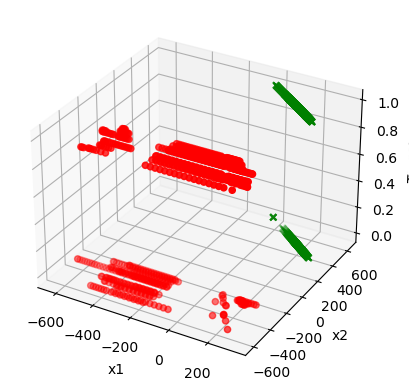
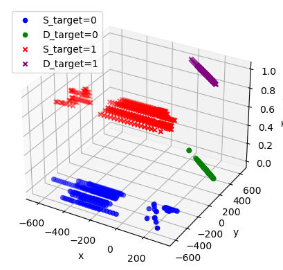
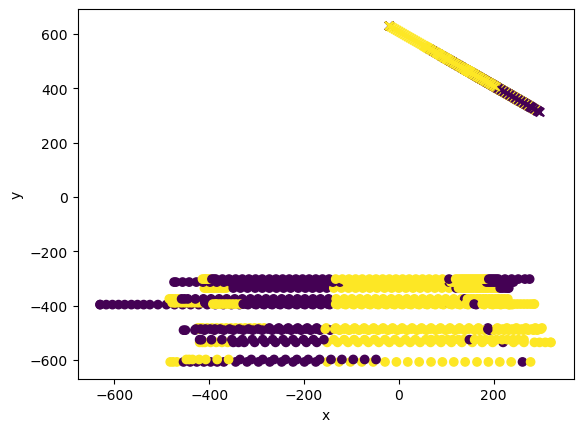
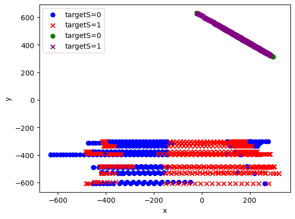

```python
# lecturas archivo.csv de estación meteorológica
import pandas as pd
import matplotlib.pyplot as plt
 
# INGRESO
narchivo = 'C:/Users/zerog/Downloads/PhaserDataset.csv'
 
# PROCEDIMIENTO
tabla = pd.read_csv(narchivo, sep=';',decimal=',')
n = len(tabla)

```


```python
import pandas as pd
import matplotlib.pyplot as plt
from mpl_toolkits.mplot3d import Axes3D

# Cargar los datos desde el CSV
df = pd.read_csv(narchivo, header=None, names=['x1', 'y1','x2', 'y2', 'targetS', 'targetD'], dtype=float )

# Crear la figura
fig = plt.figure()

# Agregar un subplot 3D
ax = fig.add_subplot(111, projection='3d')

# Graficar los puntos tridimensionales
ax.scatter(df['x1'], df['y1'], df['targetS'], c='r', marker='o')

ax.scatter(df['x2'], df['y2'], df['targetD'], c='g', marker='x')

# Etiquetas de los ejes
ax.set_xlabel('x1')
ax.set_ylabel('x2')
ax.set_zlabel('Target')

# Mostrar el gráfico
plt.show()
```


    

    


```python
import pandas as pd
import matplotlib.pyplot as plt
from mpl_toolkits.mplot3d import Axes3D

# Cargar los datos desde el CSV especificando que la primera fila es un encabezado
df = pd.read_csv(narchivo, header=None, names=['x1', 'y1','x2', 'y2', 'targetS', 'targetD'], dtype=float )
# Crear la figura 3D
fig = plt.figure()
ax = fig.add_subplot(111, projection='3d')
# Graficar puntos con target=0
ax.scatter(df[df['targetS'] == 0]['x1'], df[df['targetS'] == 0]['y1'], df[df['targetS'] == 0]['targetS'], c='blue', marker='o', label='S_target=0')
ax.scatter(df[df['targetD'] == 0]['x2'], df[df['targetD'] == 0]['y2'], df[df['targetD'] == 0]['targetD'], c='green', marker='o', label='D_target=0')
# Graficar puntos con target=1
ax.scatter(df[df['targetS'] == 1]['x1'], df[df['targetS'] == 1]['y1'], df[df['targetS'] == 1]['targetS'], c='red', marker='x', label='S_target=1')
ax.scatter(df[df['targetD'] == 1]['x2'], df[df['targetD'] == 1]['y2'], df[df['targetD'] == 1]['targetD'], c='purple', marker='x', label='D_target=1')
# Etiquetas de los ejes
ax.set_xlabel('x')
ax.set_ylabel('y')
ax.set_zlabel('Target')
# Mostrar leyenda
ax.legend()
# Mostrar el gráfico
plt.show()
```


    

    


```python
import pandas as pd
import matplotlib.pyplot as plt

# Cargar los datos desde el CSV especificando que la primera fila es un encabezado
df = pd.read_csv(narchivo, header=None, names=['x1', 'y1','x2', 'y2', 'targetS', 'targetD'], dtype=float )

# Crear la figura
plt.figure()

# Graficar los puntos en 2D
plt.scatter(df['x1'], df['y1'], c=df['targetS'], cmap='viridis', marker='o')
plt.scatter(df['x2'], df['y2'], c=df['targetD'], cmap='viridis', marker='x')

# Etiquetas de los ejes
plt.xlabel('x')
plt.ylabel('y')

# Mostrar el gráfico
plt.show()
```


    

    


```python
import pandas as pd
import matplotlib.pyplot as plt

# Cargar los datos desde el CSV especificando que la primera fila es un encabezado
df = pd.read_csv(narchivo, header=None, names=['x1', 'y1','x2', 'y2', 'targetS', 'targetD'], dtype=float )

# Crear la figura
plt.figure()

# Graficar los puntos en 2D con colores diferentes para target=0 y target=1
plt.scatter(df[df['targetS'] == 0]['x1'], df[df['targetS'] == 0]['y1'], color='blue', label='targetS=0', marker='o')
plt.scatter(df[df['targetS'] == 1]['x1'], df[df['targetS'] == 1]['y1'], color='red', label='targetS=1', marker='x')

plt.scatter(df[df['targetD'] == 0]['x2'], df[df['targetD'] == 0]['y2'], color='green', label='targetS=0', marker='o')
plt.scatter(df[df['targetD'] == 1]['x2'], df[df['targetD'] == 1]['y2'], color='purple', label='targetS=1', marker='x')

# Etiquetas de los ejes
plt.xlabel('x')
plt.ylabel('y')

# Mostrar leyenda
plt.legend()

# Mostrar el gráfico
plt.show()
```


    

    


```python

```
